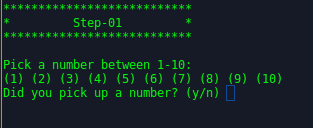
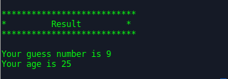

# Guesstimate
## Getting Started

Here we have shared our personal small projects written with Python3. We have collected all of the resources of this project from Open Source.

## Overview
Guessing game using Machine Learning and Artificial Intelligence 

* **Demo**

**Step 01**

  

**Result**

## Requirements

* Matplotlib
~~~~bash
pip install matplotlib
~~~~
* Tweepy
~~~~bash
pip install tweepy
~~~~
* Textblob
~~~~bash
pip install textblob
~~~~

## Authors

* **Md. Nazrul Islam Ridoy, Md. Mahbub Alam, Swapnil Saha & Proshib Saha** - *Guesstimate Game* - [rbshadow](https://github.com/rbshadow), [mahbub3330](https://github.com/mahbub3330), [swapnil]() & [proshib]()

Link: [Guesstimate Game](https://github.com/rbshadow/Guesstimate/tree/master/Guesstimate%20Game)

* **Md. Mahbub Alam** - *initial works* - [mahbub3330](https://github.com/mahbub3330)
* **Md. Nazrul Islam** - *Guesstimate Age* - [rbshadow](https://github.com/rbshadow)
* **Md. Mahbub Alam** - *Guesstimate Number* - [mahbub3330](https://github.com/mahbub3330)
* **Md. Nazrul Islam** - *Guesstimate Emotion* - [rbshadow](https://github.com/rbshadow)
* **Md. Mahbub Alam** - *Guesstimate Toss* - [mahbub3330](https://github.com/mahbub3330)

## Reference

* *[1]* *Muhammad Ali Zia* - [the-javapocalypse](https://github.com/the-javapocalypse)
* *[2]* *Noyon* - [noyonict](https://github.com/noyonict)

You are always welcome for a PR.